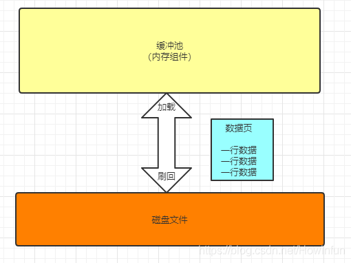
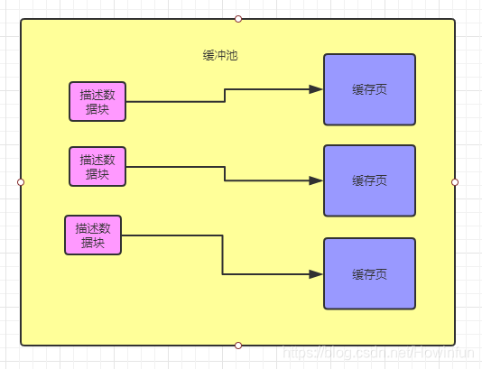
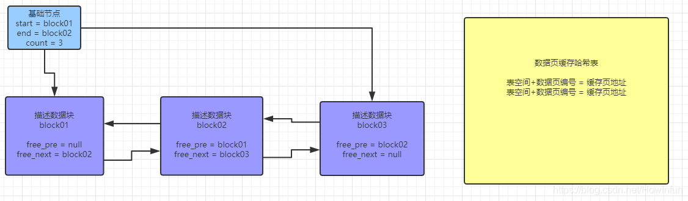
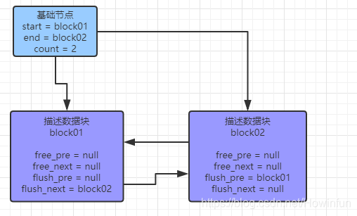

# 缓冲池

## 内存

### 内存缓冲池（buffer pool）

**InnoDB 存储引擎是基于磁盘存储的，并将其中的记录按照页的方式进管理，因此可以将其视为基于磁盘的数据库系统。**

在数据库系统中，由于 CPU 和磁盘交换速度的差距，基于磁盘的数据库系统通常使用缓冲池技术来提高数据库的整体性能。

内存缓冲池简单说就是 MySQL 进程向操作系统申请一块内存区域，通过内存的速度来弥补磁盘的速度，在数据库中读取页时，首先将磁盘读到的页放到缓冲池中，这个过程称为将页 fix 到缓冲池。

下次再读取相关的页时，下次再读取相同的页时，先判断是否在缓冲池中，若在，则称为该页在缓冲池被命中。

对于修改数据（增删改），同样首先修改缓冲池中的页，然后在以一定的频率刷新到磁盘。**通过一种被称作 checkpoint 的机制刷回磁盘。**


### 关键概念——数据页

在MySQL中，innodb表以 tablename.ibd 格式的文件存放在磁盘中。

数据页是 MySQL 抽象出来的数据单位，磁盘文件中就是存放了很多数据页，每个数据页里存放了很多行数据。**默认情况下，数据页的大小是 16KB。**

对应的，在 `Buffer Pool` 中，也是以数据页为数据单位，存放着很多数据。但是通常被叫做缓存页，因为 `Buffer Pool` 是一个缓冲池，并且里面的数据都是从磁盘文件中缓存到内存中。

所以，默认情况下缓存页的大小也是 16kb，因为它和磁盘文件中数据页是一一对应的。

缓冲池和磁盘之间的数据交换的单位是数据页，包括从磁盘中读取数据到缓冲池和缓冲池中数据刷回磁盘中。


**缓冲池中基本概念**

缓冲池是 MySQL 向操作系统申请的一块内存区域，操作系统是以页为单位对内存进行管理。

缓冲池是 InnoDB 存储引擎中最重要的组件。为了提高 MySQL 的并发性能，使用到的数据都会缓存在缓冲池中，然后所有的增删改查操作都将在缓冲池中执行。

每个更新请求，尽量就是**只更新内存，然后往磁盘顺序写日志文件**。

更新内存的性能是极高的，然后顺序写磁盘上的日志文件的性能也是比较高的，因为顺序写磁盘文件，他的性能要远高于随机读写磁盘文件。


具体来看，缓冲池中的页类型有：

- **数据页**
- **索引页**
- **undo页**
- **插入缓冲**
- **自适应哈希索引**
- **InnoDB存储的锁信息**
- **数据字典信息等。**

**不能简单的认为，缓冲池只是缓冲索引和数据页。它们只是占内存缓冲池很大的一部分而已**


> 在 Linux 中，操作系统以页为单位管理内存，无论是将磁盘中的数据加载到内存中，还是将内存中的数据写回磁盘，操作系统都会以页面为单位进行操作。
>
> 哪怕我们只向磁盘中写入一个字节的数据，我们也需要将整个页面中的全部数据刷入磁盘中。
>
> 在操作系统层面，每个进程都有自己独立的地址空间，看到的都是操作系统虚拟出来的地址空间，虚拟地址最终还是要落在实际内存的物理地址上进行操作的。
>
> 操作系统就会通过页表的机制来实现进程的虚拟地址到物理地址。其中每一页的大小都是固定的。
>
> ```shell
> ####X86：
> [root@ens8 ~]# getconf PAGESIZE
> 4096
> ####ARM：
> root@ens8ARM:~# getconf PAGESIZE
> 65536
> ```
>
> 
>
> Linux 同时支持正常大小的内存页和大内存页（Huge Page）
>
> **绝大多数处理器上的内存页（page）的默认大小都是 4KB**，虽然部分处理器会使用 8KB、16KB 或者 64KB 作为默认的页面大小，但是 4KB 的页面仍然是操作系统默认内存页配置的主流；
>
> [为什么 Linux 默认页大小是 4KB](https://draveness.me/whys-the-design-linux-default-page/) 


innodb_page_size 作为 innodb 和 OS 交互单位。文件系统对文件的 buffer IO，也是 page 为单位进行处理的。

InnoDB 缓冲池中的数据访问是以 Page 为单位的，每个 Page 的大小默认为 16KB，Buffer Pool 是用来管理和缓存这些 Page 的。


### 内存缓冲池相关参数配置

```shell


# 内存缓冲池总大小，默认是128M，应当适当设置调大buffer_pool_size,一般设置为服务器内存60%。通常实际占用的内存会比配置的还要大10%
# MySQL5.7.5之后可以动态调整。在调整innodb_buffer_pool_size 期间，用户的请求将会阻塞，直到调整完毕，所以请勿在白天调整，在凌晨3-4点低峰期调整。
innodb_buffer_pool_size=8G 
# 内存缓冲池实例数，默认是1，通过将buffer pool 分成多个区，每个区用独立的锁保护，这样就减少了访问buffer_pool时需要上锁的粒度，以提高并发能力和性能。
# 
innodb_buffer_pool_instances=16
# innodb页大小，默认是16KB，一般设置为16KB或64KB
innodb_page_size=16KB
# 在调整内存缓冲池总大小时，内部把数据页移动到一个新的位置，单位是块。如果想增加移动的速度，需要调整innodb_buffer_pool_chunk_size参数的大小，默认是128M。
# 缓冲池配置时的基本单位，以块的形式配置，指明块大小。
# innodb_buffer_pool_size=innodb_buffer_pool_chunk_size * innodb_buffer_pool_instances * n 
innodb_buffer_pool_chunk_size=128MB
```


### 什么是 LRU 算法

LRU 就是一种很常见的缓存淘汰策略。按照英文的直接原义就是 Least Recently Used，最近最久未使用。

**利用好 LRU 算法，我们能够提高对热点数据的缓存效率，进而提升缓存服务的内存使用率。**


一般计算机内存容量有限，操作系统分配给 MySQL 的内存缓存池容量自然也有限，如果缓存池满了就要删除一些内容，给新内容腾位置。

但问题是，删除哪些内容呢？我们肯定希望删掉哪些没什么用的缓存，而把有用的数据继续留在缓存里，方便之后继续使用。

那么，什么样的数据，我们判定为「有用的」的数据呢？

LRU 缓存淘汰算法就是一种常用策略。LRU 的全称是 Least Recently Used，也就是说我们认为最近使用过的数据应该是是「有用的」，很久都没用过的数据应该是无用的，内存满了就优先删那些很久没用过的数据。

它是按照一个非常著名的计算机操作系统基础理论得来的：**最近使用的页面数据会在未来一段时期内仍然被使用,已经很久没有使用的页面很有可能在未来较长的一段时间内仍然不会被使用**。

基于这个思想，会存在一种缓存淘汰机制，每次从内存中找到**最久未使用的数据然后置换出来**，从而存入新的数据！


LRU 的主要衡量指标是**使用的时间**。附加指标是**使用的次数**。

在计算机中大量使用了这个机制，它的合理性在于**优先筛选热点数据**，所谓热点数据，就是**最近最多使用的数据**！


#### LRU 的实现

- **实现 LRU 缓存的常用方法是使用固定长度的队列。实现 LRU 的关键是将所有最近使用的数据放在队列的开头。**
- **每次有新数据插入之前，我们检查队列是否已满。如果队列已满，我们将删除其最后一个元素，并将新节点插入队列的开头。**
- **如果队列未满，我们只需将数据添加到队列的开头。**


在一些大厂面试中，经常会要求手写 LRU 算法。


### LRU List

通常，数据库中的缓冲池是通过 LRU (Latest Recent Used) 算法来管理的，即最频繁使用的页在 LRU 最前端。

但是 MySQL InnoDB 对传统的 LRU 算法做了一些优化。在 buffer pool 中的的数据页可以认为是一个 LIST 列表，分为两个子列表 （New Sublist） （ Old Sublist）

```shell
# 这个参数控制着 New Sublist 和 Old Sublist 的比例 ，New Sublist占5/8，Old Sublist占3/8
innodb_old_blocks_pct=37
```


可以简单理解为 New Sublist 中的页都是最活跃的热点数据页。

当有数据页要加载到内存中，就插入到 Old Sublist 的头部，并且从 Old Sublist 尾部移除不再使用的页。

可以看到，这是一个先进先出的队列。

很明显不用一个队列来管理这些，可以避免一次大表的全表扫描，就把缓冲池中的所有数据都刷出。


MySQL默认在InnoDB缓冲池（而不是整个缓冲池）中仅保留最频繁访问页的25%  。

在多数使用场景下，合理的选择是：保留最有用的数据页，比加载所有的页(很多页可能在后续的工作中并没有访问到)在缓冲池中要更快。


```shell
# INFORMATION_SCHEMA中有几个缓冲池表提供有关InnoDB缓冲池中页面的缓冲池状态信息和元数据。

############ 查询INNODB_BUFFER_PAGE表可能会影响性能。 除非您了解性能影响并确定其可接受，否则请勿在生产系统上查询此表。 为避免影响生产系统的性能，请重现要调查的问题并在测试实例上查询缓冲池统计信息。

mysql> SHOW TABLES FROM INFORMATION_SCHEMA LIKE 'INNODB_BUFFER%';
+-----------------------------------------------+
| Tables_in_INFORMATION_SCHEMA (INNODB_BUFFER%) |
+-----------------------------------------------+
| INNODB_BUFFER_PAGE_LRU                        |
| INNODB_BUFFER_PAGE                            |
| INNODB_BUFFER_POOL_STATS                      |
+-----------------------------------------------+

# INNODB_BUFFER_PAGE：保存InnoDB缓冲池中每个页面的信息。

# INNODB_BUFFER_PAGE_LRU：保存有关InnoDB缓冲池中页面的信息，特别是它们在LRU列表中的排序方式，确定哪些页面在缓冲池变满时从缓冲池中逐出。 INNODB_BUFFER_PAGE_LRU表与INNODB_BUFFER_PAGE表具有相同的列。
# 但INNODB_BUFFER_PAGE_LRU表具有LRU_POSITION列而不是BLOCK_ID列。
# INNODB_BUFFER_POOL_STATS：提供缓冲池状态信息。许多相同的信息由SHOW ENGINE INNODB STATUS输出提供，或者可以使用InnoDB缓冲池服务器状态变量获得。
```


### 使用InnoDB标准监视器监视缓冲池

`InnoDB`可以使用访问的标准监视器输出， [`SHOW ENGINE INNODB STATUS`](https://dev.mysql.com/doc/refman/5.7/en/innodb-standard-monitor.html)提供有关缓冲池操作的度量。

缓冲池度量标准位于`BUFFER POOL AND MEMORY`“ `InnoDB`标准监视器”输出中的部分，其输出类似于以下内容：

```
----------------------
BUFFER POOL AND MEMORY
----------------------
Total large memory allocated 2198863872
Dictionary memory allocated 776332
Buffer pool size   131072
Free buffers       124908
Database pages     5720
Old database pages 2071
Modified db pages  910
Pending reads 0
Pending writes: LRU 0, flush list 0, single page 0
Pages made young 4, not young 0
0.10 youngs/s, 0.00 non-youngs/s
Pages read 197, created 5523, written 5060
0.00 reads/s, 190.89 creates/s, 244.94 writes/s
Buffer pool hit rate 1000 / 1000, young-making rate 0 / 1000 not
0 / 1000
Pages read ahead 0.00/s, evicted without access 0.00/s, Random read
ahead 0.00/s
LRU len: 5720, unzip_LRU len: 0
I/O sum[0]:cur[0], unzip sum[0]:cur[0]
```


下表描述了`InnoDB`标准监视器报告的缓冲池度量标准


| 名称                          | 描述                                                         |
| ----------------------------- | ------------------------------------------------------------ |
| ***Total memory allocated***  | ***为缓冲池分配的总内存（以字节为单位）***                   |
| Dictionary memory allocated   | 为`InnoDB`数据字典分配的总内存，以字节为单位                 |
| ***Buffer pool size***        | ***分配给缓冲池的页面总大小***                               |
| ***Free buffers***            | ***缓冲池空闲列表的页面总大小***                             |
| ***Database pages***          | ***缓冲池LRU列表的页面总大小***                              |
| ***Old database pages***      | ***缓冲池旧LRU子列表的页面总大小***                          |
| ***Modified db pages***       | ***缓冲池中当前修改的页面数***                               |
| Pending reads                 | 等待读入缓冲池的缓冲池页面数                                 |
| Pending writes LRU            | 从LRU列表的底部开始写入的缓冲池中的旧脏页数                  |
| Pending writes flush list     | 检查点期间要刷新的缓冲池页面数                               |
| Pending writes single page    | 缓冲池中暂挂的独立页面写入数                                 |
| Pages made young              | 缓冲池LRU列表中变年轻的页面总数（已移至“ new ”页面的子列表的开头） |
| Pages made not young          | 缓冲池LRU列表中没有年轻的页面总数（保留在“ old ”子列表中但没有年轻的页面） |
| ***youngs/s***                | ***每秒平均访问缓冲池LRU列表中的旧页面所导致的页面年轻***    |
| ***non-youngs/s***            | ***每秒平均访问缓冲池LRU列表中的旧页面导致的页面不年轻***    |
| Pages read                    | 从缓冲池读取的页面总数                                       |
| Pages created                 | 在缓冲池中创建的页面总数                                     |
| Pages written                 | 从缓冲池写入的页面总数                                       |
| reads/s                       | 每秒平均每秒读取的缓冲池页面数                               |
| creates/s                     | 每秒平均创建的缓冲池页面的每秒数量                           |
| writes/s                      | 每秒平均缓冲池页面写入数                                     |
| ***Buffer pool hit rate***    | ***从缓冲池内存与磁盘存储读取的页面的缓冲池页面命中率***     |
| ***young-making rate***       | ***页面访问的平均命中率使页面更年轻***                       |
| ***not (young-making rate)*** | ***页面访问未使页面变年轻的平均命中率***                     |
| Pages read ahead              | 预读操作的每秒平均数                                         |
| Pages evicted without access  | 每秒从缓冲池访问而未访问的页面的平均值                       |
| Random read ahead             | 随机预读操作的每秒平均数                                     |
| LRU len                       | 缓冲池LRU列表的页面总大小                                    |
| unzip_LRU len                 | 缓冲池unzip_LRU列表的页面总大小                              |
| I/O sum                       | 最近50秒内访问的缓冲池LRU列表页面的总数                      |
| I/O cur                       | 已访问的缓冲池LRU列表页面的总数                              |
| I/O unzip sum                 | 已访问的缓冲池unzip_LRU列表页面的总数                        |
| I/O unzip cur                 | 已访问的缓冲池unzip_LRU列表页面的总数                        |


### 缓冲池预热

https://dev.mysql.com/doc/refman/8.0/en/innodb-preload-buffer-pool.html

在生产中，重启 MySQL 后，会发现一段时间内 SQL 性能变差，然后最终恢复到原有性能。

这是因为 MySQL 已经经常操作的热点数据都已经缓存到 InnoDB Buffer Pool 缓冲池中。

MySQL 进程重启后，它在内存中的数据自然就释放了。通过业务的访问才会逐步将热点数据从磁盘缓存到 InnoDB Buffer Pool 中，从磁盘读取数据自然没有从内存读取数据快。

**MySQL 重启后，将热点数据从磁盘逐渐缓存到 InnoDB Buffer Pool 的过程称为预热（官方文档称之为warmup）。**

让应用系统自身慢慢通过SQL给 InnoDB Buffer Pool 预热成本很高，如果遇到高峰期极有可能带来一场性能灾难，业务卡顿不能顺利运营。


为了避免这种情况发生，MySQL 5.6 引入了数据预热机制，在停止数据库的时候，把内存中的热点数据dump到磁盘文件中，启动时，直接把热点数据从磁盘加载回内存中。

**需要注意的是，对于较大内存的数据库来说，配置这种预热机制，会让关闭数据库的时间非常长。同样启动过程也会延长。**

```toml
# 关闭数据库时是否保留当前的缓冲池的状态到磁盘中，MySQL5.7之后默认开启
innodb_buffer_pool_dump_at_shutdown=on
# 保留内存缓冲池中数据的比例，默认是25%
innodb_buffer_pool_dump_pct=25
# 缓冲池数据dump到磁盘中的文件名称，默认是ib_buffer_pool，一般放在
innodb_buffer_pool_filename=ib_buffer_pool

innodb_buffer_pool_load_at_startup=on

```


- innodb_buffer_pool_dump_at_shutdown 
- innodb_buffer_pool_load_at_startup 

这两个参数控制了预热，不过默认都是关闭的，需要开启。MySQL 5.7 则是默认开启。


```shell
# 
SET GLOBAL innodb_buffer_pool_dump_now=ON;
```


## 刷脏

**脏页**

当事务提交后，数据刷到磁盘之前，此时内存中的数据页和磁盘中的数据是不一致的，我们把此时内存中的这些数据页成为脏页。

**刷脏**


### 多线程刷脏

- 5.6版本以前，脏页的清理工作交由 master thread的；

- Page cleaner thread是 5.6.2 引入的一个新线程（单线程），从master线程中卸下buffer pool刷脏页的工作独立出来的线程(默认是启一个线程)；

- 5.7开始支持多线程刷脏页；


## 为什么会出现

InnoDB是基于**磁盘**存储的，并将其中的数据按**页的方式**进行管理。因此InnoDB可视为基于磁盘的数据库系统。由于CPU的速度和磁盘IO速度的巨大鸿沟，需要缓冲池来提高数据库的整体性能

## 是什么

缓冲池是主内存中的一个区域，在`InnoDB`访问表和索引数据时会在其中进行 高速缓存。缓冲池允许直接从内存中处理经常使用的数据，从而加快了处理速度。在专用服务器上，通常将多达80％的物理内存分配给缓冲池。

为了提高大容量读取操作的效率，缓冲池被分为多个[页面](https://dev.mysql.com/doc/refman/5.7/en/glossary.html#glos_page)，这些[页面](https://dev.mysql.com/doc/refman/5.7/en/glossary.html#glos_page)可能包含多个行。为了提高缓存管理的效率，缓冲池被实现为页面的链接列表。使用[LRU](https://dev.mysql.com/doc/refman/5.7/en/glossary.html#glos_lru)算法的变体将很少使用的数据从缓存中老化掉 。

知道如何利用缓冲池将经常访问的数据保留在内存中是MySQL优化的重要方面。

## 架构

简要架构图


## 关键概念 —— 数据页

它是 MySQL 抽象出来的数据单位，磁盘文件中就是存放了很多数据页，每个数据页里存放了很多行数据。

默认情况下，数据页的大小是 16kb。大概结果如下图所示


所以对应的，在 `Buffer Pool` 中，也是以数据页为数据单位，存放着很多数据。但是我们通常叫做缓存页，因为 `Buffer Pool` 毕竟是一个缓冲池，并且里面的数据都是从磁盘文件中缓存到内存中。

所以，默认情况下缓存页的大小也是 16kb，因为它和磁盘文件中数据页是一一对应的。

所以，缓冲池和磁盘之间的数据交换的单位是数据页，包括从磁盘中读取数据到缓冲池和缓冲池中数据刷回磁盘中，如图所示：



## 怎么做的

- 第一次读取数据时，首先从磁盘中读取数据页，并放到(FIX)缓冲池中。
- 再次读取同样的数据时，先看缓冲池中是否有相同的数据页。有则命中，从缓冲池中读取。否则从磁盘读取

缓冲池是 InnoDB 存储引擎中最重要的组件。因为为了提高 MySQL 的并发性能，使用到的数据都会缓存在缓冲池中，然后所有的增删改查操作都将在缓冲池中执行。

通过这种方式，保证每个更新请求，尽量就是**只更新内存，然后往磁盘顺序写日志文件**。

更新内存的性能是极高的，然后顺序写磁盘上的日志文件的性能也是比较高的，因为顺序写磁盘文件，他的性能要远高于随机读写磁盘文件。

## 服务器的内存大小很重要

```
mysql> show variables like 'innodb_buffer_pool_size';
+-------------------------+---------+
| Variable_name           | Value   |
+-------------------------+---------+
| innodb_buffer_pool_size | 8388608 |
+-------------------------+---------+
1 row in set (0.02 sec)
```

## 缓冲池中缓存的数据页类型

- 索引页
- 数据页
- undo页
- 插入缓冲(Insert buffer)
- 自适应哈希索引
- 锁信息
- 数据字典信息(data dictionary)

## 怎么识别数据在哪个缓存页中？

到此，我们都知道 `Buffer Pool` 中是用缓存页来缓存数据的，但是我们怎么知道缓存页对应着哪个表，对应着哪个数据页呢？

所以每个缓存页都会对应着一个描述数据块，里面包含数据页所属的表空间、数据页的编号，缓存页在 `Buffer Pool` 中的地址等等。

描述数据块本身也是一块数据，它的大小大概是缓存页大小的5%左右，大概800个字节左右的大小。

描述如图所示：



## 缓冲池实例

### 概念

即缓冲池的个数。每页根据哈希值分配到不同缓冲池实例

###		好处

减少资源竞争、支持更大的并发处理，加快查询速度

### 查看缓冲池实例个数

查看缓冲池实例个数(默认为 1)

```
mysql> show variables like 'innodb_buffer_pool_instances';
+------------------------------+-------+
| Variable_name                | Value |
+------------------------------+-------+
| innodb_buffer_pool_instances | 1     |
+------------------------------+-------+
1 row in set (0.03 sec)
```

​	可通过配置文件修改实例个数

## Buffer Pool 如何应对高并发场景

### 1、单个 Buffer Pool 的问题

直到现在，估计大家都以为缓冲池只是一个大的内存区域，在 InnoDB 存储引擎中只有一个，这是对的吗？

我们可以想象，如果 InnoDB 存储引擎只有一个 `Buffer Pool`，当高并发时，多个请求进来，那么为了保证数据的一致性（缓存页、free 链表、flush 链表、lru 链表等多种操作），必须得给缓冲池加锁了，每一时刻只能有一个请求获得锁去操作 `Buffer Pool`，其他请求只能排队等待锁释放。那么此时 MySQL 的性能是多么的低！

### 2、多个 Buffer Pool

既然一个 `Buffer Pool` 不够用，那么整多几个呗。

在生产环境中，其实我们是可以给 MySQL 设置多个 `Buffer Pool` 来提升 MySQL 的并发能力的~

**如何设置？**

我们先看看 MySQL 的默认规则：如果你给 `Buffer Pool` 分配的内存小于1GB，那么最多就只会给你一个 `Buffer Pool`。

但是呢，如果你给 MySQL 设置的内存很大，此时你可以利用下面两个参数来设置 `Buffer Pool` 的总大小和总实例数，这样，MySQL 就能有多个 `Buffer Pool` 来支撑高并发了。

```shell
[server] 
innodb_buffer_pool_size = 8589934592 
innodb_buffer_pool_instances = 4
```

解释一下：上面利用参数 `innodb_buffer_pool_size` 来设置 `Buffer Pool` 的总大小为 8G，利用参数 `innodb_buffer_pool_instances` 来设置一共有 4个 `Buffer Pool` 实例。那么就是说，MySQL 一共有 4个 `Buffer Pool` ，每个的大小为 2G。

当然了，每个 `Buffer Pool` 负责管理着自己的描述数据块和缓存页，有自己独立一套 free 链表、flush 链表和 lru 链表。

到这，我们就晓得，只要你能分配足够大的内存给 `Buffer Pool` ，你就能创建尽量多的 `Buffer Pool` 来应对高并发场景~

正所谓，并发性能不高，机器配置来凑，这还是有道理的。

但是正经点来说，最基本最主要的还是咱们写的 SQL。当然了，能写出一手好 SQL，前提我们还是得理解 MySQL 各个组件的原理，熟悉索引的原理、事务原理和锁原理等。当然了，之后我也会分别对这些做出一个学习总结分享出来。

### 3、生产环境中，如何动态调整 Buffer Pool 的大小

相信基本每个公司，项目上线后，用户和流量会不断地增长，这对于 MySQL 来说，会有什么变化？

首先，访问增多，不断地从磁盘文件中的数据页读取数据到 `Buffer Pool`，也不断地将 `Buffer Pool` 的脏缓存页刷回磁盘文件中。很明显的，`Buffer Pool` 越小，这两个操作就会越频繁，但是磁盘IO操作又是比较耗时的，本来 SQL 执行只要 20 ms，如果碰巧碰到遇到缓存页用完，就要经历一系列的操作，SQL 最后执行完可能就要 200 ms，甚至更多了。

所以我们此时需要及时调整 `Buffer Pool` 的大小。

#### Ⅰ、如何动态调整 Buffer Pool 的大小？

但是生产环境，肯定不能让我们直接修改 MySQL 配置然后再重启吧，这估计要骂死。

在 MySQL 5.7 后，MySQL 允许我们动态调整参数 `innodb_buffer_pool_size` 的值来调整 `Buffer Pool` 的大小了。

**假如就这样直接调大会存在啥问题？**

假设调整前的配置：Buffer Pool 的总大小为8G，一共4个 Buffer Pool，每个大小为 2G。

```shell
[server] 
innodb_buffer_pool_size = 8589934592 
innodb_buffer_pool_instances = 4
```

假设给 `Buffer Pool` 调整到 16 G，就是说参数 `innodb_buffer_pool_size` 改为 17179869184。

此时，MySQL 会为 `Buffer Pool` 申请一块大小为16G 的连续内存，然后分成 4块，接着将每一个 `Buffer Pool` 的数据都复制到对应的内存块里，最后再清空之前的内存区域。

我们可以发现，**全部数据要从一块地方复制到另外一块地方**，那这是相当耗费时间的操作，整整8个G的数据要进行复制粘贴呢！而且，如果本来 `Buffer Pool` 是更大的话，那就更恐怖了。

#### Ⅱ、Buffer Pool 的 chunk 机制

为了解决上面的问题，`Buffer Pool` 引入一个机制：chunk 机制。

1. 每个 `Buffer Pool` 其实是由多个 chunk 组成的。每个 chunk 的大小由参数 `innodb_buffer_pool_chunk_size` 控制，默认值是 128M。
2. 每个 chunk 就是一系列的描述数据块和对应的缓存页。
3. 每个 `Buffer Pool` 里的所有 chunk 共享一套 free、flush、lru 链表。

得益于 chunk 机制，就能避免了上面说到的问题。当扩大 `Buffer Pool` 内存时，不再需要全部数据进行复制和粘贴，而是在原本的基础上进行增减内存。

下面继续用上面的例子，介绍一下 chunk 机制下，`Buffer Pool` 是如何动态调整大小的。

调整前 `Buffer Pool` 的总大小为 8G，调整后的 `Buffer Pool` 大小为 16 G。

由于 `Buffer Pool` 的实例数是不可以变的，所以是每个 `Buffer Pool` 增加 2G 的大小，此时只要给每个 `Buffer Pool` 申请 （2000M/128M）个chunk就行了，但是要注意的是，新增的每个 chunk 都是连续的128M内存。

### 4、生产环境中，应该给 Buffer Pool 设置多大的内存

#### Ⅰ、如何设置 Buffer Pool 的总内存大小

我们都知道，给 Buffer Pool 分配越大的内存，MySQL 的并发性能就越好。那是不是都应该将百分之九十九的机器的内存都分配给 Buffe Pool 呢？

那当然不是了！

先不说操作系统内核也需要几个G内存，MySQL 除了 Buffer Pool 还有很多别的内存数据结构呢，这些都是需要内存的，所以说，上面的想法是绝对不行的！

比较合理的比例，应该是 Buffer Pool 的内存大小占机器总内存的 **50% ~ 60%**，例如机器的总内存有32G，那么你给 Buffer Pool 分配个20G左右就挺合理的了。

#### Ⅱ、如何设置 Buffer Pool 的实例数

Buffer Pool 的总大小搞定了，那应该设置多少个实例数呢？

这里有一个公式：**Buffer Pool 总大小 = （chunk 大小 \* Buffer Pool数量）\* n倍**。

上个例子解释一下。

假设此时 Buffer Pool 的总大小为 8G，即 8192M，那么 Buffer Pool 的数量应该是多少个呢？

> 8192 = （ 128 * Buffer Pool 数量）* n

64 个：也是可以的，但是每个 Buffer Pool 就只要一个 chunk。

16 个：也是可以的，每个 Buffer Pool 拥有四个 chunk。

8 个：也是可以的，每个 Buffer Pool 拥有八个 chunk。

所以说，只要你的 Buffer Pool 数量符合上面的公式，其实都是可以的，看你们根据业务后怎么选择了。

## Buffer Pool 的初始化

到此，我们都知道了，`Buffer Pool` 是缓存数据的数据单位为缓存页，利用描述数据块来标识缓存页。

那么，MySQL 启动时，是如何初始化 `Buffer Pool` 的呢？

1. MySQL 启动时，会根据参数 `innodb_buffer_pool_size` 的值来为 `Buffer Pool` 分配内存区域。

2. 然后会按照缓存页的默认大小 16k 以及对应的描述数据块的 800个字节 左右大小，在 `Buffer Pool` 中划分中一个个的缓存页和一个个的描述数据库块。

3. 注意，此时的缓存页和描述数据块都是空的，毕竟才刚启动 MySQL 呢。

## LRU list

### 传统的LRU

按照英文的直接原义就是Least Recently Used,最近最久未使用。

#### 由来

它是按照一个非常著名的计算机操作系统基础理论得来的：**最近使用的页面数据会在未来一段时期内仍然被使用,已经很久没有使用的页面很有可能在未来较长的一段时间内仍然不会被使用**。基于这个思想,会存在一种缓存淘汰机制，每次从内存中找到**最久未使用的数据然后置换出来**，从而存入新的数据！

#### 作用

它的主要衡量指标是**使用的时间**，

(附加指标是**使用的次数**)


在计算机中大量使用了这个机制，它的合理性在于**优先筛选热点数据**，所谓热点数据，就是**最近最多使用的数据**！

#### 特征

- **最新的数据会插入对列前面**
- **访问列表中旧的数据，会使它重新置于列表顶部**

### InnoDB中的LRU

缓冲池中，页的大小也是16KB

#### 与传统LRU特殊的地方

新增了midPoint位置。新读取到的页并没有直接放在LRU列的首部，而是放在距离尾部37%的位置。这个算法称之为**midpoint insertion stategy**。

- 即midPoint在整体列表的 5/8 处

- midpoint之前的是new区域（热数据）

- midpoint之后的数据是不活跃数据，old区域。
- midpoint处，是新子列表的尾部与旧子列表的头相交的边界
- 当InnoDB将页面读入缓冲池时，它首先将其插入中点(旧子列表的头部)。因为它是用户发起的操作(如SQL查询)所需的，或者是InnoDB自动执行的预读操作的一部分，所以这些页面可以被读取。
- 访问旧子列表中的页面会使其变得“年轻”，并将其移动到新子列表的头部。如果由于用户启动的操作需要该页而读取该页，则会立即进行第一次访问，并使该页变得年轻。如果该页是由于预读操作而被读取的，则第一次访问不会立即发生，并且在该页被逐出之前可能根本不会发生。
- 当数据库运行时，缓冲池中未被访问的页通过向列表的尾部移动来“老化”。新子列表和旧子列表中的页面都会随着其他页面变为新页面而老化。旧子列表中的页面也会随着页面插入到中点处而老化。最终，未使用的页面到达旧子列表的尾部并被逐出。


#### 查看midpoint

```
mysql> show variables like 'innodb_old_blocks_pct';
+-----------------------+-------+
| Variable_name         | Value |
+-----------------------+-------+
| innodb_old_blocks_pct | 37    |
+-----------------------+-------+
1 row in set (0.04 sec)
```

- 37：末尾处的37%的位置，即末尾 3/8 的位置

#### 为什么不把最新查到的数据放到首部

例如**索引扫描**或**数据扫描** / **全表扫描**，会使大量的缓冲池中大量的页被刷新出去。然而被扫描到的数据页只是本次操作所需要的，并非热点数据。而真正的热点数据还是从磁盘读取，影响了缓冲池效率。

MySQL 为了提高性能，提供了一个机制：**预读机制**。

当你从磁盘上加载一个数据页的时候，他可能会连带着把这个数据页相邻的其他数据页，也加载到缓存里去。这个机制会带来这么一个问题：连带的数据页可能在后面的查询或者修改中，并不会用到，但是它们却在 lru 链表的头部。


> 若还未理解，可参阅官方文档：[防止缓冲池扫描](https://dev.mysql.com/doc/refman/5.7/en/innodb-performance-midpoint_insertion.html)

#### 缓冲池可调整的配置

- 理想情况下，您可以将缓冲池的大小设置为尽可能大的值，从而为服务器上的其他进程留出足够的内存来运行，而不需要过多的分页。缓冲池越大，InnoDB就越像内存中的数据库，从磁盘读取数据一次，然后在后续读取期间访问内存中的数据。但并不是越大越好

- 在具有足够内存的64位系统上，您可以将缓冲池拆分为多个部分，以最大限度地减少并发操作之间对内存结构的争用。即增加缓冲池实例

- 您可以将频繁访问的数据保留在内存中，而不考虑会将大量不经常访问的数据引入缓冲池的操作的突然活动高峰。可以调整midpoint的位置。

- 您可以控制如何以及何时执行预读请求，以便在预期很快需要页面的情况下将页面异步预取到缓冲池中。

- 您可以控制何时发生后台刷新，以及是否根据工作负载动态调整刷新速率

- 您可以配置InnoDB如何保留当前的缓冲池状态，以避免服务器重启后过长的预热期

- 控制最新数据页放到热点区域的时间，达到这个时间后，就可以把数据放到热点区域。

  ```
  mysql> show variables like 'innodb_old_blocks_time';
  +------------------------+-------+
  | Variable_name          | Value |
  +------------------------+-------+
  | innodb_old_blocks_time | 1000  |
  +------------------------+-------+
  1 row in set (0.04 sec)
  ```

  - 数据从old转到new，此操作称为page made young
  - 数据未从old转到new，此操作称为page not made young

#### 使用InnoDB标准监视器监视缓冲池

`InnoDB`可以使用访问的标准监视器输出， [`SHOW ENGINE INNODB STATUS`](https://dev.mysql.com/doc/refman/5.7/en/innodb-standard-monitor.html)提供有关缓冲池操作的度量。缓冲池度量标准位于`BUFFER POOL AND MEMORY`“ `InnoDB`标准监视器”输出中的部分，其输出类似于以下内容：

```shell
----------------------
BUFFER POOL AND MEMORY
----------------------
Total large memory allocated 2198863872
Dictionary memory allocated 776332
Buffer pool size   131072
Free buffers       124908
Database pages     5720
Old database pages 2071
Modified db pages  910
Pending reads 0
Pending writes: LRU 0, flush list 0, single page 0
Pages made young 4, not young 0
0.10 youngs/s, 0.00 non-youngs/s
Pages read 197, created 5523, written 5060
0.00 reads/s, 190.89 creates/s, 244.94 writes/s
Buffer pool hit rate 1000 / 1000, young-making rate 0 / 1000 not
0 / 1000
Pages read ahead 0.00/s, evicted without access 0.00/s, Random read
ahead 0.00/s
LRU len: 5720, unzip_LRU len: 0
I/O sum[0]:cur[0], unzip sum[0]:cur[0]
```

下表描述了`InnoDB`标准监视器报告的缓冲池度量 标准

|             名称              | 描述                                                         |
| :---------------------------: | :----------------------------------------------------------- |
| ***Total memory allocated***  | ***为缓冲池分配的总内存（以字节为单位）***                   |
|  Dictionary memory allocated  | 为`InnoDB`数据字典分配的总内存，以字节为单位                 |
|    ***Buffer pool size***     | ***分配给缓冲池的页面总大小***                               |
|      ***Free buffers***       | ***缓冲池空闲列表的页面总大小***                             |
|     ***Database pages***      | ***缓冲池LRU列表的页面总大小***                              |
|   ***Old database pages***    | ***缓冲池旧LRU子列表的页面总大小***                          |
|    ***Modified db pages***    | ***缓冲池中当前修改的页面数***                               |
|         Pending reads         | 等待读入缓冲池的缓冲池页面数                                 |
|      Pending writes LRU       | 从LRU列表的底部开始写入的缓冲池中的旧脏页数                  |
|   Pending writes flush list   | 检查点期间要刷新的缓冲池页面数                               |
|  Pending writes single page   | 缓冲池中暂挂的独立页面写入数                                 |
|       Pages made young        | 缓冲池LRU列表中变年轻的页面总数（已移至“ new ”页面的子列表的开头） |
|     Pages made not young      | 缓冲池LRU列表中没有年轻的页面总数（保留在“ old ”子列表中但没有年轻的页面） |
|        ***youngs/s***         | ***每秒平均访问缓冲池LRU列表中的旧页面所导致的页面年轻***    |
|      ***non-youngs/s***       | ***每秒平均访问缓冲池LRU列表中的旧页面导致的页面不年轻***    |
|          Pages read           | 从缓冲池读取的页面总数                                       |
|         Pages created         | 在缓冲池中创建的页面总数                                     |
|         Pages written         | 从缓冲池写入的页面总数                                       |
|            reads/s            | 每秒平均每秒读取的缓冲池页面数                               |
|           creates/s           | 每秒平均创建的缓冲池页面的每秒数量                           |
|           writes/s            | 每秒平均缓冲池页面写入数                                     |
|  ***Buffer pool hit rate***   | ***从缓冲池内存与磁盘存储读取的页面的缓冲池页面命中率***     |
|    ***young-making rate***    | ***页面访问的平均命中率使页面更年轻***                       |
| ***not (young-making rate)*** | ***页面访问未使页面变年轻的平均命中率***                     |
|       Pages read ahead        | 预读操作的每秒平均数                                         |
| Pages evicted without access  | 每秒从缓冲池访问而未访问的页面的平均值                       |
|       Random read ahead       | 随机预读操作的每秒平均数                                     |
|            LRU len            | 缓冲池LRU列表的页面总大小                                    |
|         unzip_LRU len         | 缓冲池unzip_LRU列表的页面总大小                              |
|            I/O sum            | 最近50秒内访问的缓冲池LRU列表页面的总数                      |
|            I/O cur            | 已访问的缓冲池LRU列表页面的总数                              |
|         I/O unzip sum         | 已访问的缓冲池unzip_LRU列表页面的总数                        |
|         I/O unzip cur         | 已访问的缓冲池unzip_LRU列表页面的总数                        |

- ***youngs/s***
  仅适用于old页。它基于对页面的**访问次数**，而不是页面数量。可以对给定页面进行多次访问，所有这些访问都会被计算在内。如果在没有进行大型扫描的情况下看到非常低的Young/s值，则可能需要减少延迟时间或增加用于旧子列表的缓冲池的百分比。增加百分比会使旧子列表变大，因此该子列表中的页面需要更长时间才能移动到尾部，这会增加再次访问这些页面并使其年轻化的可能性。
- ***non-youngs/s***
  仅适用于旧页。它基于对页面的访问次数，而不是页面数量。可以对给定页面进行多次访问，所有这些访问都会被计算在内。如果在执行大型表格扫描时未看到更高的***non-youngs/s***值(以及更高的***youngs/s***值)，请增加延迟值。
- ***young-making rate***
  该值考虑了对所有缓冲池页面的访问，而不仅仅是对旧子列表中的页面的访问。young-making rate和not-young-making rate通常不等于总缓冲池命中率。旧子列表中的页面命中会导致页面移动到新子列表，而新子列表中的页面命中会导致页面仅在与头部有一定距离时才移动到列表的头部。
- ***not (young-making rate)***
  Not(Young-Making Rate)是由于未满足Innodb_old_block_time定义的延迟，或由于新子列表中的页面命中未导致页面移动到页头而导致页面访问未导致页面年轻的平均命中率。此速率考虑了对所有缓冲池页面的访问，而不仅仅是对旧子列表中的页面的访问。

>  缓冲池[服务器状态变量](https://dev.mysql.com/doc/refman/5.7/en/server-status-variables.html)和 [`INNODB_BUFFER_POOL_STATS`](https://dev.mysql.com/doc/refman/5.7/en/information-schema-innodb-buffer-pool-stats-table.html)表提供了许多与`InnoDB`标准监视器输出中相同的缓冲池度量 标准

#### unzip_LRU

InnoDB从1.0.X开始支持页压缩技术。原本16k的页，可以压缩到2k、4k、8k。因此需要unzip_LRU列来管理，但是注意：LRU list中包含了unzip_LRU

如何给unzip_LRU分配内存：（假设需要从缓冲池中申请4KB大小的内存）

- 检查4KB的unzip_LRU列表，检查是否有可用的空闲页
- 若有，则直接使用
- 否则申请8KB的unzip_LRU页
- 若能申请到页，则拆分成两个4KB页，并存放到unzip_LRU列表
- 如果申请不到，则从LRU列表申请一个16K的页面，拆分成一个8K，两个4k，分别放到对应的unzip_LRU列表中

## Free list

### 结构

它是一个双向链表，链表的每个节点就是一个个空闲的缓存页对应的描述数据块。

他本身其实就是由 `Buffer Pool` 里的描述数据块组成的，你可以认为是每个描述数据块里都有两个指针，一个是 free_pre 指针，一个是 free_next 指针，分别指向自己的上一个 free 链表的节点，以及下一个 free 链表的节点。

通过 `Buffer Pool` 中的描述数据块的 free_pre 和 free_next 两个指针，就可以把所有的描述数据块串成一个 free 链表。

下面我们可以用伪代码来描述一下 free 链表中描述数据块节点的数据结构：

```c
DescriptionDataBlock{
    block_id = block1;
    free_pre = null;
    free_next = block2;
}
```

free 链表有一个基础节点，他会引用链表的头节点和尾节点，里面还存储了链表中有多少个描述数据块的节点，也就是有多少个空闲的缓存页。

下面我们也用伪代码来描述一下基础节点的数据结构：

```java
FreeListBaseNode{
    start = block01;
    end = block03;   
    count = 2;
}
```

到此，free 链表就介绍完了。上面我们也介绍了 MySQL 启动时 `Buffer Pool` 的初始流程，接下来，我会将结合刚介绍完的 free 链表，讲解一下 SQL 进来时，磁盘数据页读取到 `Buffer Pool` 的缓存页的过程。但是，我们先要了解一下一个新概念：数据页缓存哈希表，它的 key 是表空间+数据页号，而 value 是对应缓存页的地址。

描述如图所示：



### 磁盘数据页读取到 `Buffer Pool` 的缓存页的过程

1. 首先，SQL 进来时，判断数据对应的数据页能否在 数据页缓存哈希表里 找到对应的缓存页。

2. 如果找到，将直接在 `Buffer Pool` 中进行增删改查。

3. 如果找不到，则从 free 链表中找到一个空闲的缓存页，然后从磁盘文件中读取对应的数据页的数据到缓存页中，并且将数据页的信息和缓存页的地址写入到对应的描述数据块中，然后修改相关的描述数据块的 free_pre 指针和 free_next 指针，将使用了的描述数据块从 free 链表中移除。记得，还要在数据页缓存哈希表中写入对应的 key-value 对。最后也是在 `Buffer Pool` 中进行增删改查。

### Free list 和 LRU List 关系

数据库刚启动时，LRU list是空的。Free list是最大的。当需要从缓冲池中分页时，看Free list有空闲页：

- 有则删除Free list的页，加入到LRU list中。维持一个数量平衡

- 否则，根据LRU算法，淘汰LRU末尾的页，省出内存来，分配给新的页

- **lru 链表尾部的缓存页何时刷入磁盘?**

  当 free list 为空了，此时需要将数据页加载到缓冲池里，就会 lru list 的 old 数据区域尾部的缓存页刷入磁盘，然后清空，再加载数据页的数据。

  一条后台线程，运行一个定时任务，定时将 lru list 的 old 数据区域的尾部的一些缓存页刷入磁盘，然后清空，最后把他们对应的描述数据块加入到 free 链表中去。

  当然了，除了 lru list尾部的缓存页会被刷入磁盘，还有的就是 flush list 的缓存页。

  后台线程同时也会在 MySQL 不繁忙的时候，将 flush 链表中的缓存页刷入磁盘中，这些缓存页的描述数据块会从 lru 链表和 flush 链表中移除，并加入到 free 链表中。

## Flush list

### 脏页（dirty page）

我们都知道 SQL 的增删改查都在 `Buffer Pool` 中执行，慢慢地，`Buffer Pool` 中的缓存页因为不断被修改而导致和磁盘文件中的数据不一致了，也就是 `Buffer Pool` 中会有很多个脏页，脏页里面很多脏数据。

所以，MySQL 会有一条后台线程，定时地将 `Buffer Pool` 中的脏页刷回到磁盘文件中。

但是，后台线程怎么知道哪些缓存页是脏页呢，不可能将全部的缓存页都往磁盘中刷吧，这会导致 MySQL 暂停一段时间。

MySQL通过checkPoint技术将脏页刷新到磁盘

- Flush list中的页，即为脏页
- 脏页既存在于LRU列表中，也存在于Flush list中（LRU列表用来管理缓冲池中页的可用性，Flush list脏页刷新到磁盘，两者互不影响）

### 结构

Flush list 也是通过缓存页的描述数据块中的两个指针，让修改过的缓存页的描述数据块能串成一个双向链表，这两指针大家可以认为是 flush_pre 指针和 flush_next 指针。

下面我用伪代码来描述一下：

```java
DescriptionDataBlock{
    block_id = block1;
    // free 链表的
    free_pre = null;
    free_next = null;

    // flush 链表的
    flush_pre = null;
    flush_next = block2;
}
```

flush 链表也有对应的基础节点，也是包含链表的头节点和尾节点，还有就是修改过的缓存页的数量。

```java
FlushListBaseNode{
    start = block1;
    end = block2;
    count = 2;
}
```

到这里，我们都知道，SQL 的增删改都会使得缓存页变为脏页，此时会修改脏页对应的描述数据块的 flush_pre 指针和 flush_next 指针，使得描述数据块加入到 flush 链表中，之后 MySQL 的后台线程就可以将这个脏页刷回到磁盘中。

描述如图所示：



## 总结

到此，我已经将缓冲池 `Buffer Pool`介绍完毕了。

下面简单总结一下 `Buffer Pool` 从初始化到使用的整个流程。

1、MySQL 启动时会根据分配指定大小内存给 `Buffer Pool`，并且会创建一个个描述数据块和缓存页。

2、SQL 进来时，首先会根据数据的表空间和数据页编号查询 数据页缓存哈希表 中是否有对应的缓存页。

3、如果有对应的缓存页，则直接在 `Buffer Pool`中执行。

4、如果没有，则检查 free 链表看看有没有空闲的缓存页。

5、如果有空闲的缓存页，则从磁盘中加载对应的数据页，然后将描述数据块从 free 链表中移除，并且加入到 lru 链表的old数据区域的链表头部。后面如果被修改了，还需要加入到 flush 链表中。

6、如果没有空闲的缓存页，则将 lru 链表的old数据区域的链表尾部的缓存页刷回磁盘，然后清空，接着将数据页的数据加载到缓存页中，并且描述数据块会加入到 lru 链表的old数据区域的链表头部。后面如果被修改了，还需要加入到 flush 链表中。

7、5或者6后，就接着在 `Buffer Pool` 中执行增删改查。

注意：5和6中，缓存页加入到old数据区域的链表头部后，如果在 1s 后被访问，则将入到new数据区域的链表头部。

8、最后，就是描述数据块随着 SQL 语句的执行不断地在 free 链表、flush 链表和 lru 链表中移动了。